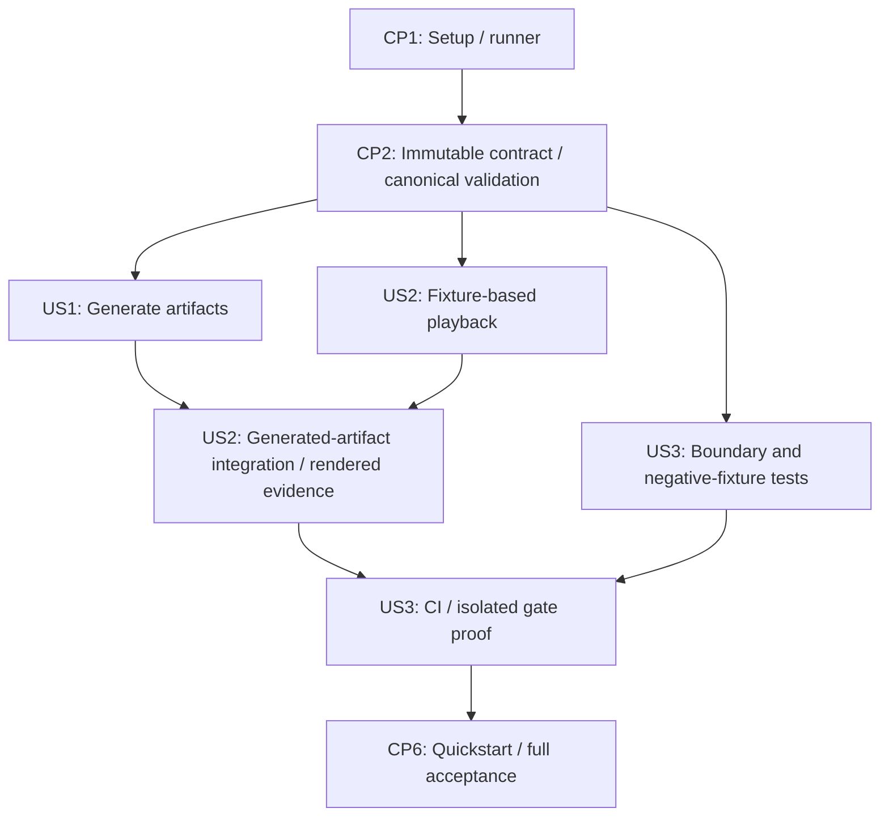

# Tasks: M0 專案骨架與遙測模擬器

> Markers: [ ] not started · [-] implemented, awaiting review · [X] reviewed + verified

**Input**: `specs/001-telemetry-simulator/` 的 spec.md、plan.md、research.md、data-model.md、contracts/ 與 quickstart.md。
**Prerequisites**: Specify／clarify／plan 已完成；所有路徑相對 repository root。
**Tests**: spec.md 的 FR-017／FR-018 與 SC-001–SC-006 明確要求自動化與 rendered 驗證，因此包含測試任務。測試先寫，再完成相對應實作；記錄對應行為的失敗與通過，不能把缺少 dependency 的錯誤當作行為驗證。
**Organization**: 依 US1（P1）→ US2（P2）→ US3（P3）分組。共同 foundation 不含運動產生或 playback 業務行為。

## Format & Execution Rules

- 任務格式為 `- [ ] Tnnn [P?] [USn?] 描述與明確檔案路徑`；所有任務初始為 `[ ]`。
- `[P]` 只表示列出的 prerequisites 完成後，該組不同檔案的任務可並行；不表示可跳過 phase gate。未標示者按編號順序執行。
- 實作前依 `~/.agents/skills/delegated-tdd/SKILL.md` 對剩餘 scope 執行 delegation gate，並確認 `.agents/skills/speckit-implement/SKILL.md` 與 `.claude/skills/speckit-implement/SKILL.md` 的接線；本輪生成任務不等於開始 implementation run。
- 執行進度採 `[ ]` → `[-]`（已實作、待 review）→ `[X]`（review 通過且主代理複驗）；文件與純 setup 的驗證方式依 delegation gate 結果記錄，不虛構 RED。
- 寫檔測試一律明示 pytest `tmp_path`，不繼承 `.env` 或 shared storage destination；CLI subprocess 也遵守此限制。故意改壞的 source 僅放在隔離 worktree／scratch copy。負向案例的 pytest parameter IDs 或測試名稱標明對應 FR／SC，讓 gate failure 指出被破壞的要求。
- M0 只實作 Simulator、artifact validation 與 playback。DSL、Evaluator、Fuzzer 保留空 package；不引入 grammar、C++ build、sensor noise 或效能 Gate。
- 各演算法模組 MUST 依 `docs/algorithms/001-m0-telemetry-and-playback.md` 留下來源／章節引用與白話橋接、公式和資料結構對應；T007／T012／T014／T022／T023 承接，T035 核對。完整說明放在該文件，模組引用對應章節，不複製成多份會漂移的說明。
- 終點採已裁示的拒絕規則：從未量化 source 計算總時長 `T` 與 rate `r`，要求 `T × r` 為整數，再產生包含終點的完整 tick grid；未對齊在任何 output directory 建立前拒絕。內部階段切換仍可不對齊，細節以 `specs/001-telemetry-simulator/data-model.md` 的 Terminal alignment 為準。

## Phase 1: Setup — 共同開發環境

**Purpose**: 建立 plan.md 所指定的單一 Python `src` layout 與可執行 test runner。

- [X] T001 建立 `pyproject.toml`、`.python-version` 與 `src/assertion_engine/__init__.py`，使用 CPython 3.14、單一可安裝 package；建立 `src/assertion_engine/simulator/__init__.py`、`src/assertion_engine/playback/__init__.py`、`src/assertion_engine/dsl/__init__.py`、`src/assertion_engine/evaluator/__init__.py`、`src/assertion_engine/fuzzer/__init__.py`，後三者僅保留邊界。
- [X] T002 在 `pyproject.toml` 設定 Matplotlib 3.11.x、jsonschema 4.x、pytest 與 Ruff，設定 installed-package／src-layout 測試與 Ruff lint/format；以 uv 0.11.x 產生並提交 `uv.lock`，驗證 `uv sync --locked` 與 pytest collection 可執行，保留現有 `.gitignore` 的 `.venv`、cache、`build/` 與 `dist/` 忽略規則。

**Checkpoint CP1**: 乾淨環境能 sync locked dependencies，runner 可收集測試；尚未宣稱任何 domain behavior 通過。

## Phase 2: Foundational — 共享 artifact 契約

**Purpose**: US1／US2 共用的不可變資料、canonical bytes 與純 validator；不呼叫 Simulator 或依賴 Matplotlib。

- [X] T003 依 `specs/001-telemetry-simulator/contracts/*.schema.json` 手工建立 `tests/fixtures/valid_artifacts/telemetry.json`（artifact 1.0.0）與 `tests/fixtures/valid_artifacts/ground-truth.json`（artifact 2.0.0）；使用 1 m 高度、1 m 距離、1 m/s 升降與巡航、1 s hover、1 m observation spacing、seed 42、100% 初始電量與每秒 0.2% 耗電，提供 t=0–5 的六筆完整 snapshots、五段時間線與 `start_sequence_number` 字面值 `0, 1, 2, 3, 4`。預期座標／速度／電量／phase 歸屬用獨立字面值撰寫，不呼叫 generator 建立 fixture。
- [X] T004 [P] 在 `tests/contract/test_artifact_schemas.py` 為共享 validator 撰寫有效 pair 與違規測試：snapshot 恰好六欄、vector 長度、單 vehicle 與 source identity、非負整數 seed、telemetry 1.0.0／ground truth 2.0.0、有限數值／百分比、sequence/time 起點與連續性、五階段順序／覆蓋及 terminal ownership。Ground-truth `start_sequence_number` 必填非負整數且等於 exact `ceil(s_i × r)`、位於 `0…N`、非遞減；錯值／缺值／無序／超界／legacy ground truth 1.0.0 必須拒絕。增加 3 Hz／5 s／16 snapshots，時間字面值 `0, 0.333333, 0.666667, 1` 與終點 `5`，驗證 source-derived `Q(k × Δt)`、metadata mismatch 拒絕、`T × r` 非整數 source 拒絕及禁止用 rounded interval 累加；使用 committed schemas 與 T003 fixture。（depends on T003）
- [X] T005 [P] 在 `tests/contract/test_canonical_serialization.py` 撰寫 sorted keys、compact separators、UTF-8、單一 trailing LF、六位小數 ties-to-even（如 `0.0000005 → 0`、`0.0000015 → 0.000002`）、negative-zero normalization、source input numeric values 保留、拒絕 NaN/Infinity、無 run-specific metadata 與 canonical source equality 測試；同一輸入連續序列化三次須 byte-identical，以字面預期 bytes 判定，不用受測 serializer 產生預期值。（depends on T003）
- [X] T006 在 `src/assertion_engine/telemetry.py` 定義不可變的 TelemetrySnapshot、ScenarioSource、TelemetryArtifact、PhaseInterval 與 GroundTruthArtifact；PhaseInterval 包含 `start_sequence_number`，telemetry／ground truth 版本各為 1.0.0／2.0.0，source/config 不變。Snapshot 僅六欄，NED vectors 與集合不可透過 playback 改寫，對照 `specs/001-telemetry-simulator/data-model.md` 保留中立資料邊界。
- [X] T007 在 `src/assertion_engine/artifacts.py` 實作 canonical serialization、JSON decode／shape 與 semantic validation、source pairing；由 repository 中 `specs/001-telemetry-simulator/contracts/*.schema.json` 建立本地 schema registry，離線解析相對 `$ref`，驗證 source-derived NED／battery model 與 phase timeline；從非衍生 source 重建精確 interval 與 phase starts，驗證 `T × r` 為整數、`Q(k × Δt)`、rounded metadata／phase coordinates、`start_sequence_number = ceil(s_i × r)` 的範圍／順序／唯一 snapshot 歸屬，引用 `docs/algorithms/001-m0-telemetry-and-playback.md` §1。禁止累加 rounded interval 或以 rounded 時間改判 phase；拒絕 unsupported versions（包含 legacy ground truth 1.0.0）／非法 source／非連續時間／phase 洩漏／非法終點，不 import simulator、DSL、Evaluator 或 Fuzzer，讓 T004–T005 通過。

**Checkpoint CP2**: 手工 fixture pair 通過，已知 shape／semantic／byte 違規被拒絕；US1 與 US2 可只依賴共同 contract 展開。

## Phase 3: User Story 1 — 產生可重現的正常任務（P1，MVP）

**Goal**: 明確 TOML 與 seed 產生完整正常任務，atomically publish 分離的 telemetry／ground truth。
**Independent Test**: 基準設定生成三次，各自兩組 SHA-256 相同；每份 451 snapshots，t=0–45 s、10 Hz、六欄、五階段、終點原點／零速／91% 電量；invalid input 不 publish output。

### Tests for US1

- [X] T008 [P] [US1] 在 `tests/unit/simulator/test_config.py` 撰寫 TOML 必填／型別／非有限值／範圍、seed、derived rate 與耗電超支測試；使用 `tmp_path` 的 TOML，涵蓋缺值、zero/negative rate inputs、非法電量／drain、unsupported config version、六位小數下無法保持正 metadata／嚴格遞增的設定；以未量化 `T × r` 驗證 terminal alignment，10 Hz／45.05 s 與 45.0000004 s 必須拒絕，即使後者量化為 45 s。3 Hz／5 s 的 15 個完整 intervals 與內部階段不對齊但終點對齊的設定必須可接受。
- [X] T009 [P] [US1] 在 `tests/unit/simulator/test_scenario.py` 撰寫 tick-based 運動／電量／時間線測試：0/10/15/25/35/45 s 的字面 expected states、NED 符號、2 m/s 與 0.2 m 導出 10 Hz、exact `[start,end)` ownership、基準序號邊界 `0, 100, 150, 250, 350`、終點零速、零 hover／未包含 snapshot 的 phase 與內部 off-grid 切換；驗證 20/50/100 Hz 的 901/2251/4501 snapshots，以及 3 Hz／5 s 的 16 snapshots、時間 `0, 0.333333, 0.666667, 1` 與終點 `5`。加入 data-model.md 的 A1 3 Hz／4 s 案例，序號邊界必須為 `0, 2, 3, 6, 9`，tick 1 屬 takeoff 且 down velocity = -1、tick 2 屬 hover、tick 12 屬 landing，即使 tick 1 與 hover 起點都顯示 `0.333333`。
- [X] T010 [P] [US1] 在 `tests/integration/test_generate_normal_flight.py` 撰寫 generate CLI 成功與三次重現測試；用 `tmp_path` 的三個 output directories，其中至少一個含初始不存在的巢狀 parent，驗證自動建立 parents 並完整發布兩份 artifacts；獨立驗證 snapshot 契約、字面正常路徑／phase boundaries／terminal battery、telemetry 無 phase 與 source metadata 一致，解析 stdout 的兩組 path／SHA-256 並比對實際檔案。
- [X] T011 [P] [US1] 在 `tests/integration/test_generate_failures.py` 撰寫 invalid arguments/config、終點未對齊、existing target 保留 sentinel、parent 建立與 staging write/publish 失敗的 CLI 測試；無效 arguments／設定／未對齊用 `tmp_path` 下尚不存在的巢狀 parent，驗證 exit 2、欄位／terminal diagnostics、parent／final target 均未建立；以 ancestor 是檔案的路徑驗證 parent 建立失敗 exit 1 與 path diagnostic。Staging／publish 失敗須清理本次 staging、不發布 final directory、保留既有 parent／sentinel，已建立 parent 可留存；所有 destination 僅在 `tmp_path`。

### Implementation for US1

- [X] T012 [P] [US1] 在 `src/assertion_engine/simulator/config.py` 實作 TOML parsing、ScenarioConfiguration validation 與 normalized ScenarioSource；從非衍生 source 參數的 canonical 十進位表示建立精確有理 rate/interval、計算 durations 與電量耗盡預檢，只將衍生 metadata 套用 `Q`；以未量化 `T × r` 判定整數 terminal tick count，在任何 output directory 建立前拒絕未對齊、非法值或無法保持正 metadata／嚴格遞增的精度設定，引用 `docs/algorithms/001-m0-telemetry-and-playback.md` §1。（depends on T008–T011）
- [X] T013 [P] [US1] 在 `scenarios/normal-flight.toml` 寫入 research.md 的基準：vehicle-001、seed 42、10 m 高度、1 m/s 升降、5 s hover、20 m 北向距離、2 m/s 巡航、0.2 m observation spacing、100% 初始電量與每秒 0.2 percentage points 耗電、schema/scenario versions 1.0.0。（depends on T008–T011）
- [X] T014 [US1] 在 `src/assertion_engine/simulator/scenario.py` 以已驗證的整數 `N = T × r` 產生 `k = 0…N` 的完整 ticks，使用未量化的有理 interval 計算 `t_k = k × Δt`，依 exact source phase 產生運動／電量，保存 calculated values 才套用六位小數 ties-to-even `Q`。Ground truth 2.0.0 同時保存各段 `start_sequence_number = ceil(s_i × r)`，不得量化後再取整；保留可 off-grid 的內部 boundaries、空 snapshot 區間、終點零速與六欄 telemetry 1.0.0，引用 `docs/algorithms/001-m0-telemetry-and-playback.md` §1–§2 的教材與資料對應，不引入 raw sensors、noise 或 random metadata。（depends on T012–T013）
- [X] T015 [US1] 在 `src/assertion_engine/simulator/cli.py` 實作 `assertion-sim generate --scenario ... --output ...`，並在 `pyproject.toml` 註冊 entry point；先驗證 arguments／設定並拒絕 existing destination，再生成／驗證兩份 canonical bytes，之後建立明示的 missing parent directories、於該 parent 下 staging 並 publish 完成目錄。無效設定 exit 2 且不建立目錄；parent／staging／publish 失敗 exit 1、清理本次 staging、保留 parents 與既有內容，輸出契約規定的 JSON paths／hashes 與 exit/stderr，讓 T008–T011 通過。（depends on T014、T007）
- [X] T016 [US1] 在 `specs/001-telemetry-simulator/validation.md` 記錄 US1 驗證命令、runner 摘要與三次兩組 hashes；執行 `tests/contract/`、`tests/unit/simulator/`、`tests/integration/test_generate_normal_flight.py` 與 `tests/integration/test_generate_failures.py`，確認 invalid inputs／未對齊終點的拒絕無目錄副作用、四種基準取樣率與 3 Hz 精度案例、巢狀 parent 成功／失敗與既有目錄保留皆符合契約。（depends on T015）

**Checkpoint CP3**: US1 可單獨 demo，完成 deterministic artifacts 與 generation failure semantics；playback／DSL／Evaluator 不是此 checkpoint 的依賴。

## Phase 4: User Story 2 — rendered playback 檢查軌跡（P2）

**Goal**: 唯讀載入既有 artifact pair，提供同步視圖與播放 controls，不重算 mission state。
**Independent Test**: 使用 T003 手工 pair、不呼叫 generator，測試 load／play／pause／step／speed／restart／completed；畫面值對應選取 snapshot，操作前後 input hashes 相同，非法 pair 不播放或 publish PNG。

### Tests for US2

- [X] T017 [P] [US2] 在 `tests/unit/playback/test_loader.py` 撰寫 valid／missing-field／wrong-order／unsupported-version／mismatched-source／invalid-phase pair 載入測試，包含缺少或錯誤 `start_sequence_number` 及 legacy ground truth 1.0.0 的拒絕／重新生成遷移診斷；使用 T003 fixture 的 `tmp_path` copies，驗證清楚拒絕且不補值、不改 input。（depends on CP2）
- [X] T018 [P] [US2] 在 `tests/unit/playback/test_view_model.py` 撰寫 session 狀態與控制測試，使用可控制的時鐘驗證 play/pause、step、speed 僅改 wall-clock cadence、restart 回 0、completed 保留 terminal sample、display-only altitude/speed 與原始 mission time；phase 依 ground-truth 序號邊界判定。用獨立手工 A1 pair 驗證 `0, 2, 3, 6, 9` 邊界下 tick 1 仍 takeoff、tick 2 hover、tick 12 landing，包含 exact boundary、相同邊界的空 phase、最後多段同起點與 terminal inclusion；不能呼叫 generator 產生預期值。（depends on CP2）
- [X] T019 [P] [US2] 在 `tests/unit/playback/test_matplotlib_view.py` 使用 Agg 撰寫 N/E marker、altitude／speed／battery plots、五段 ground-truth annotation、同步 cursors／phase/time label 與 widget callbacks 的 rendering 測試；驗證 drawn data／PNG 可生成，不只檢查檔案存在。（depends on CP2）
- [X] T020 [P] [US2] 在 `tests/integration/test_playback_read_only.py` 撰寫 playback CLI／完整 control sequence 的 input-hash 驗證，以及 `--speed`、PNG parent、missing input、schema／semantic／source mismatch 的 exit 2 與未 publish headless output；legacy ground truth 1.0.0 必須 exit 2、提示重新生成且原檔 hash 不變。測試 headless terminal frame、exit 1 rendering failure 與 entry point，所有 copies／PNGs 位於 `tmp_path`。（depends on CP2）

### Implementation for US2

- [X] T021 [P] [US2] 在 `src/assertion_engine/playback/loader.py` 使用 T007 的共用 validator 載入兩份檔案，依 canonical ScenarioSource 配對並提供不可變 artifact pair；拒絕非法 input，不 import simulator 或改寫檔案。（depends on T017–T020）
- [X] T022 [P] [US2] 在 `src/assertion_engine/playback/view_model.py` 實作與 GUI 無關的 PlaybackSession／cursor／wall-clock multiplier 與 display-only altitude/speed；phase lookup 取固定五段順序中最後一個 `start_sequence_number <= sequence_number` 的 phase，時間只讀原始 snapshot 作顯示，不以 rounded phase time 改判或重算 timeline。引用 `docs/algorithms/001-m0-telemetry-and-playback.md` §3 的教材與 cursor／snapshot 對應；不依賴 loader I/O 或 generator，不做插值／平滑／運動與電量重算。（depends on T017–T020）
- [X] T023 [US2] 在 `src/assertion_engine/playback/matplotlib_view.py` 實作有標籤的 N/E route、current marker、同步 altitude/speed/battery 時間圖與 cursors、五階段 annotations、phase/time 顯示與 controls；當前 phase label／marker styling 讀 T022 的序號判定結果，rounded ground-truth time 僅作 plot annotations，不能從顯示座標重判 phase。Interactive 與 Agg terminal render 共用 T022 view model，引用 `docs/algorithms/001-m0-telemetry-and-playback.md` §4。（depends on T022）
- [X] T024 [US2] 在 `src/assertion_engine/playback/cli.py` 實作 `assertion-playback --telemetry ... --ground-truth ... [--speed ...] [--headless-output ...]` 並在 `pyproject.toml` 註冊 entry point；先 validate pair 與正 speed／明示 PNG parent，GUI 正常關窗 exit 0、Agg 只輸出 terminal PNG 不開窗，符合 exit 1／2 與 input 唯讀契約。（depends on T021–T023；T015 必須先完成或序列化 pyproject.toml 修改）
- [X] T025 [US2] 執行 `tests/unit/playback/` 與 `tests/integration/test_playback_read_only.py`，再以 US1 基準成品驗證配對；在 `specs/001-telemetry-simulator/validation.md` 記錄 control sequence、input hashes 不變與 runner 摘要，確保 fixture-only playback 測試不依賴 generator。（depends on T024、CP3）
- [X] T026 [US2] 依 `specs/001-telemetry-simulator/quickstart.md` 產出並實際檢視 rendered PNG／五階段畫面，確認 route 回原點、同步圖可辨識五階段、現在 phase/time 可讀；在 `specs/001-telemetry-simulator/validation.md` 記錄圖片路徑、檢視結果與 GUI backend 情況，有 GUI 時再走完整 interactive controls，不把只有測試 pass 當作 SC-005 視覺驗收。（depends on T025）

**Checkpoint CP4**: US2 對 fixture 與基準成品都成立，headless 有實際 rendered 證據，controls 不改寫 input 或 mission time。

## Phase 5: User Story 3 — 自動化門檻與責任邊界（P3）

**Goal**: 乾淨 checkout 具有一致 change gate，並證明 gate 會抓住契約／重現性違規。
**Independent Test**: locked sync、Ruff 與 Agg pytest 在乾淨版本通過；隔離副本各注入至少一個事件契約與 byte reproducibility 違規，原驗證入口失敗且對應要求的測試變紅。

### Tests for US3

- [X] T027 [P] [US3] 在 `tests/architecture/test_dependency_boundaries.py` 撰寫 module import／責任邊界檢查：Fuzzer 禁止依賴 DSL AST/grammar 或 Evaluator semantics，playback 禁止依賴 simulator，M0 的 DSL／Evaluator／Fuzzer 無業務行為；以測試內臨時 source tree 的 absolute／relative 禁止 import 正反例證明檢查有效。（depends on CP2）
- [X] T028 [P] [US3] 在 `tests/fixtures/invalid_artifacts/` 建立 `extra-phase.telemetry.json`、`missing-field.telemetry.json`、`wrong-sequence.telemetry.json`、`mismatched-source.ground-truth.json` 與 `noncanonical.telemetry.json`，並在 `tests/contract/test_gate_rejection.py` 驗證各自拒絕與 FR／SC 對應；fixture 以 T003 為基礎手工改一處，不由 generator 定義預期違規。（depends on CP2）

### Implementation & Gate Proof for US3

- [X] T029 [US3] 在 `tests/architecture/test_dependency_boundaries.py` 完成獨立 AST/import boundary scanner，使 T027 的 production 檢查與臨時違規正反例都成立；掃描 `src/assertion_engine/fuzzer/`、`src/assertion_engine/playback/` 與保留 packages，不靠目錄存在或 grep 一種 import 寫法宣稱隔離。（depends on T027）
- [X] T030 [US3] 在 `.github/workflows/ci.yml` 建立 push／pull_request change gate：Ubuntu、CPython 3.14、uv 0.11.x、`uv sync --locked`、`uv run ruff format --check .`、`uv run ruff check .` 與 `MPLBACKEND=Agg uv run pytest`；Actions 使用實際查證的完整 commit SHA 加版本註解，CI 不依賴 GUI 或網路 schema resolution。先取得一次真實 workflow PASS 與實際 check 名稱，再將對應 required status checks 設為 main 的生效合併規則，讓 missing／failed checks 阻擋 merge；讀回規則確認，於 `CLAUDE.local.md` 與 `specs/001-telemetry-simulator/validation.md` 記錄 check 名稱／run URL／探測結果，不預設其他 repo 的 context。（depends on CP3、CP4、T028–T029）
- [X] T031 [US3] 在 `README.md` 記錄 Simulator／playback／DSL／Evaluator／Fuzzer／scenarios／tests 的責任、環境與兩個 CLI 範例、相同本地 gate 命令，連到 `specs/001-telemetry-simulator/quickstart.md`；明示 M0 範圍、canonical artifacts 與 E2/E3 latency ladder，不宣稱未量測的 real-time 效能。（depends on T030）
- [X] T032 [US3] 在兩個隔離 worktree／scratch checkout 分別注入事件契約違規（例如額外 snapshot phase）與 byte reproducibility 違規（例如同一輸入的序列化 bytes 隨呼叫次數改變），執行 T030 的未修改 gate；確認失敗源自對應 contract／三次 byte equality tests，而非 Ruff、import 或環境失敗，先確認各副本使用的 installed package 來自該副本，在 `specs/001-telemetry-simulator/validation.md` 記錄受審 commit、mutation、runner 摘要、失敗測試／FR/SC 與乾淨版本 PASS，不改主工作區 source。（depends on T030–T031）
- [X] T033 [US3] 從乾淨 checkout 重跑 `.github/workflows/ci.yml` 的相同入口與 CLI smoke，在 `specs/001-telemetry-simulator/validation.md` 記錄 runner 摘要／GitHub check URL；讀回 main 的生效 required status checks，核對 names 與實際 PR check results 一致、missing／failed checks 受合併規則阻擋，不以 `MERGEABLE / CLEAN` 代替此驗證。核對 T027–T032 的 permanent negative fixtures、boundary scanner 與隔離 gate failure evidence，讓 SC-006 成為可重跑的驗收。（depends on T032）

**Checkpoint CP5**: FR-016–FR-018／SC-006 有正負驗證，CI 與本地使用相同 gate；Fuzzer 獨立性由 executable check 強制。

## Phase 6: Polish & Cross-Cutting Validation

- [X] T034 核對並更新 `specs/001-telemetry-simulator/quickstart.md` 的 locked sync、三次生成、hash comparison、interactive／headless 與 gate 步驟；在明示的 `build/artifacts/` 新目錄或 disposable checkout 執行，記錄於 `specs/001-telemetry-simulator/validation.md`，保留拒絕覆寫行為。（depends on CP5）
- [-] T035 在 `specs/001-telemetry-simulator/validation.md` 彙整 FR-001–FR-018 與 SC-001–SC-006 的測試／rendered evidence／runner 摘要、版本與環境；核對 T007／T012／T014／T022／T023 的模組引用與 `docs/algorithms/001-m0-telemetry-and-playback.md` 來源、章節、白話與資料對應一致。核對 `.specify/memory/constitution.md` 原則 II 已填入的 ladder、`specs/001-telemetry-simulator/research.md` 推導與 10/20/50/100 Hz 生成測試一致，記錄 `1/rate` 導出的 100/50/20/10 ms 與 10-rule future corpus；保留 E2/E3 標記，不宣稱 Evaluator latency E1 或效能 Gate。（depends on T034）
- [ ] T036 依 `specs/001-telemetry-simulator/spec.md` 完整核對兩個 CLI、artifact versions、error side effects、五階段 rendered 視覺驗收與 M0 scope，重跑最終 Ruff／Agg pytest 並在 `specs/001-telemetry-simulator/validation.md` 記錄結果；只有實作、review 與主代理複驗均完成才翻轉相應任務標記。（depends on T035）

**Checkpoint CP6**: 三個 stories 與完整 quickstart 成立，證據可追溯；feature 才進入 PR ready／closeout。

## Dependencies & Execution Order

- **Phase 1**: T001 → T002；**Phase 2**: T003 → (T004 + T005) → T006 → T007。CP2 阻擋全部 story implementation。
- **US1**: (T008 + T009 + T010 + T011) → (T012 + T013) → T014 → T015 → T016。
- **US2**: (T017 + T018 + T019 + T020) → (T021 + T022) → T023 → T024 → T025 → T026。T023 只需 T022；T024 還需 T021。T024 修改 `pyproject.toml`，必須避開 T015。
- **US3**: CP2 後 T027 + T028 可平行；T029 依賴 T027；T030 等 CP3／CP4 與 T028／T029 完成，再按 T031 → T032 → T033 執行。
- **Polish**: CP5 → T034 → T035 → T036。
- US1 與 US2 核心可在 CP2 後並行，US2 先用獨立 fixture。T025 的 integration 才要求 US1 完成；`pyproject.toml`、共用 `artifacts.py` 與 `validation.md` 的修改須序列化。

## Parallel Examples

| Story / group | Prerequisites | 可同時執行的任務 | 不互相依賴的檔案 |
|---|---|---|---|
| Foundation contract tests | T003 | T004、T005 | `tests/contract/test_artifact_schemas.py`、`tests/contract/test_canonical_serialization.py` |
| US1 tests | CP2 | T008、T009、T010、T011 | 兩個 unit test files 與兩個 integration test files |
| US1 config / baseline | T008–T011 | T012、T013 | `simulator/config.py`、`scenarios/normal-flight.toml` |
| US2 tests | CP2 | T017、T018、T019、T020 | loader、view-model、Matplotlib unit tests 與 playback integration test |
| US2 loader / session | T017–T020 | T021、T022 | `playback/loader.py`、`playback/view_model.py`；共同 immutable types 已由 T006 定義 |
| US3 tests | CP2 | T027、T028 | `tests/architecture/test_dependency_boundaries.py` 與 `tests/fixtures/invalid_artifacts/`／`tests/contract/test_gate_rejection.py` |

這些是可併行的工作範例；實際是否委派由 implementation run 的 delegation gate 決定。

## Requirement Coverage

| Requirements | 對應任務與主要驗證 |
|---|---|
| FR-001 | T008、T011–T012：config prevalidation／拒絕原因與 side effects |
| FR-002–FR-003 | T009–T010、T013–T014：正常五階段、NED 路徑與 10/20/50/100 Hz |
| FR-004–FR-008 | T004、T006–T007、T009–T010、T014、T018、T022：六欄、vehicle、順序／時間、NED、derived scalar speed |
| FR-009 | T008–T010、T012–T014：線性 battery／電量耗盡拒絕 |
| FR-010 | T003–T004、T009–T010、T014、T018：分離 ground truth、邊界與 terminal ownership |
| FR-011 | T005、T010、T012、T014–T016：source metadata、canonical bytes 與三次 hashes |
| FR-012 | T006、T013–T014、T031、T036：upstream state estimate／M0 scope |
| FR-013–FR-015 | T017–T026：pair validation、唯讀 view model／controls、rendered UI 與 input hashes |
| FR-016 | T001、T027、T029、T031：空 future packages 與 executable boundaries |
| FR-017–FR-018 | T004–T005、T027–T033、T036：共同 gate、negative fixtures 與隔離失敗驗證 |
| SC-001–SC-003 | T009–T010、T016：三次 hashes、六欄／無 phase、451 snapshots／終點 |
| SC-004–SC-005 | T018–T020、T025–T026：原始事件時間與實際 rendered 視覺驗收 |
| SC-006 | T027–T033、T036：乾淨 gate PASS、兩類刻意違規使對應測試 FAIL |

## Implementation Strategy

1. **MVP first**：完成 T001–T016，只交付 US1 的 deterministic normal-flight artifacts 與 generation CLI；獨立驗證後再進入完整 M0。
2. **Incremental delivery**：加入 US2 的 fixture-based playback，再驗證真實生成成品與 rendered 畫面；接著完成 US3 的 CI／責任邊界／gate 失敗證據，最後走完整 quickstart。
3. **Checkpoint discipline**：每個 CP 留可驗證的 commit 與 runner 摘要；測試 task 的首次 RED 只表示測試已建立，相關 story checkpoint 必須實作通過後才成立。review protocol 由 delegation gate 決定。
4. **Scope discipline**：不實作 M1 parser、M2 Evaluator、M3 sliding windows 或 M4 Fuzzer；不為 future C++ 預建 build system，不把 provisional latency arithmetic 當 E1。
